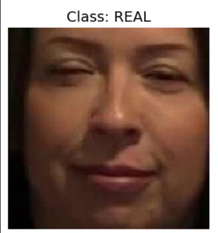
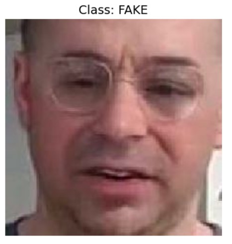
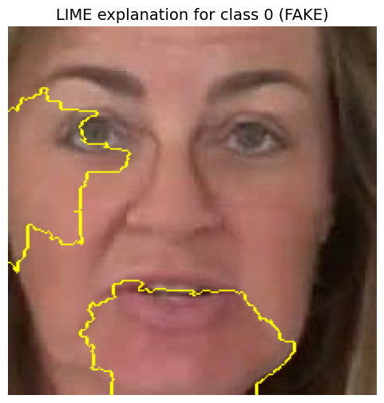

# 🧠 Deepfake Image Detection Using AI

> ⚠️ Identifying what’s fake using AI.

**Deepfakes** are a growing concern in the world of digital media. This project presents a powerful AI-based approach for detecting deepfake images using computer vision, deep learning, and model explainability tools like LIME.

---

## 🚀 Project Highlights

✅ Deep learning-based image classification  
✅ Image preprocessing and normalization  
✅ Integration with transfer learning models  
✅ LIME Explainability for model transparency  
✅ Evaluation metrics: Accuracy, confusion matrix  
✅ Visual predictions over test samples  

---

## 📁 Repository Structure

```
deepfake-image-detection/
├── DEEPFAKE IMAGE DETECTION USING AI 11.ipynb  # Main notebook
├── assets/                                     # Sample output images
└── README.md                                   # Project documentation
```

---

## 🧑‍💻 Technologies Used

| Tool / Library     | Purpose                            |
|--------------------|-------------------------------------|
| Python 3.x         | Programming language                |
| TensorFlow / Keras | Deep learning and modeling          |
| OpenCV             | Image processing                    |
| NumPy, Pandas      | Data manipulation                   |
| Matplotlib         | Visualization                       |
| scikit-learn       | Evaluation metrics                  |
| LIME               | Model explainability / interpretability |

---

## 📦 Installation & Setup

1. **Clone the repository:**

```bash
git clone https://github.com/your-username/deepfake-image-detection.git
cd deepfake-image-detection
```

2. **Create and activate a virtual environment (optional):**

```bash
python -m venv venv
source venv/bin/activate  # On Windows: venv\Scripts\activate
```

3. **Run the notebook:**

```bash
jupyter notebook
```

Open `DEEPFAKE IMAGE DETECTION USING AI 11.ipynb` and follow the steps.

---

## 🧪 How It Works

### 📥 1. Image Preprocessing
- Resize, normalize images
- Noise reduction (if applicable)

### 🧠 2. Deep Learning Model
- Load pre-trained model or define CNN
- Train with labeled data (real vs fake)

### 📊 3. Evaluation & Output
- Plot accuracy/loss curves
- Confusion matrix
- Visual classification of sample images

---

## 🧠 Explainability with LIME

This project integrates **LIME (Local Interpretable Model-agnostic Explanations)** to increase model transparency and interpretability.

✅ Understand **why** the model predicted an image as real or fake  
✅ Visual explanations highlight **important pixel regions**  
✅ Enhance trust and **debugging ability** for deep learning models

> 📍 Example: LIME will highlight facial regions that influenced the classification decision.

---

## 📊 Sample Output

<table>
  <tr>
    <th>Real Image</th>
    <th>Predicted Real</th>
  </tr>
  <tr>
    <td></td>
    <td>✅</td>
  </tr>
  <tr>
    <th>Deepfake Image</th>
    <th>Predicted Fake</th>
  </tr>
  <tr>
    <td></td>
    <td>❌</td>
  </tr>
  <tr>
    <th colspan="2">LIME Explanation</th>
  </tr>
  <tr>
    <td colspan="2"></td>
    <td>LIME Explanation for fake image</td></td>
  </tr>
</table>


---

## 🔍 Recommended Datasets

- [DeepFake Detection Challenge (Kaggle)](https://www.kaggle.com/c/deepfake-detection-challenge)

---

## 💡 Future Improvements

- Real-time video deepfake detection
- Streamlit or Flask web deployment
- Enhanced model interpretability with Grad-CAM
- Cross-dataset generalization

---

## 🤝 Contributing

We welcome contributions! To contribute:

1. Fork this repo
2. Create a new branch (`feature/your-feature`)
3. Commit your changes
4. Open a pull request

---

## 👨‍💻 Author

**Sai Srujan**  

---

## ⭐️ Show Your Support

If you find this project useful, please give it a ⭐ on GitHub — it helps others discover it!
